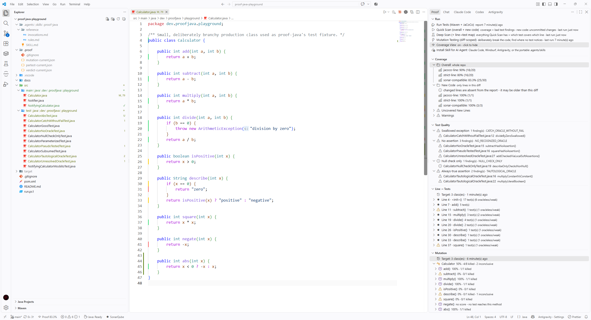
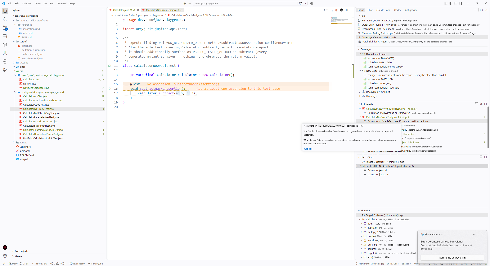
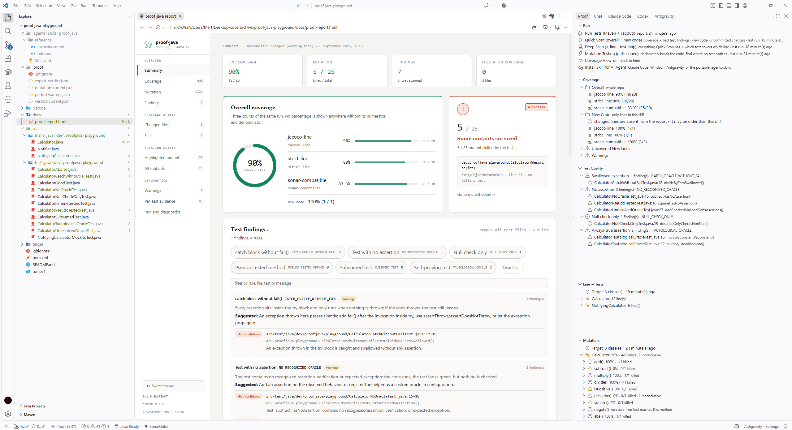
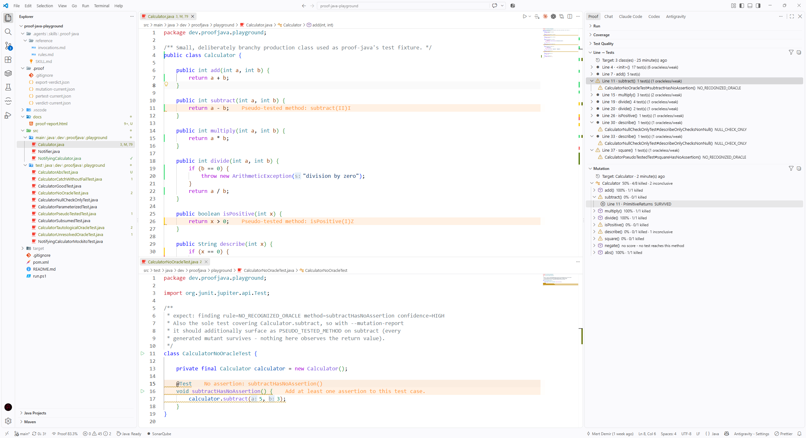

# Proof for VS Code

See which of your passing tests actually prove anything — inline, as you
code.

Coverage tells you a line executed. It doesn't tell you that anything
checked what that line did. This extension runs [proof-java](https://github.com/Metonya/proof-java)
against your workspace and shows its verdict directly in the editor: which
lines are covered, which of the tests covering them have no real assertion,
and — when you ask for it — which mutations nothing catches.

Works in VS Code, Cursor, and Windsurf.


<!-- Suggested shot: a Java file open with the coverage gutter visible
     (a mix of covered/uncovered/oracleless lines) and Explorer badges
     showing in the sidebar file tree. This is the first thing a visitor
     sees - the one screenshot that has to sell the idea on its own. -->

## Why

A green test suite and a high coverage percentage both quietly assume the
same thing: that the code checking your program actually works. It's
common for that assumption to be wrong — a test with no assertion, a test
that compares a constant to itself, a test whose only checks sit inside a
`try` block that swallows the exception. All three run green. All three
raise your coverage number. None of them would catch a real bug.

Proof reads the evidence your build already produces (a JaCoCo report, your
git diff, and — optionally — a PIT mutation run) and turns it into specific
findings, shown where you're already looking: the editor gutter, a hover,
the Problems panel.

## Features

- **Coverage gutter** — inline, colored by line: covered, partially
  covered, uncovered, excluded, or *oracleless* (covered, but by tests with
  no real assertion) — with its own distinct color, because "covered" and
  "meaningfully tested" are not the same claim.
- **Explorer badges** — coverage percentage on every file and folder in
  the file tree, rolled up from the same data as the gutter.
- **Line → Tests** — for the file you have open: which tests cover a given
  line, and whether each one has a real oracle. In a test file, the same
  view runs in reverse: which production lines does *this* test actually
  exercise.
- **Test Quality view** — every finding (no assertion, tautological
  assertion, swallowed exception, null-check-only, and more), filterable
  and groupable by rule or by file, with a plain-language explanation for
  each.
- **Mutation testing** — run PIT against a single class (usually a few
  seconds) or a whole module (minutes, behind a confirmation, since it can
  run long). Results: class → method → mutant → the tests that failed to
  kill it, with live progress.
- **Problems panel integration** — every finding also shows up as a
  standard VS Code diagnostic, so it participates in the usual
  navigation/quick-fix flow.
- **HTML export** — a single, offline HTML report of the current results,
  for sharing outside the editor.
- Every number comes from the CLI's own JSON. The extension never parses
  coverage XML, runs git, or computes a percentage itself.

## Screenshots

**Line → Tests** — which tests cover this line, and whether each one has a
real oracle (a test file open shows the reverse: which lines this test
actually exercises).



**Test Quality** — every finding, filterable and groupable by rule or file.



**Mutation** — class → method → mutant → the tests that failed to kill it,
with live progress on a run.



<!-- Drop the four PNGs above into media/screenshots/ with these exact
     filenames (hero-gutter, line-to-tests, test-quality, mutation) and
     they'll show up here and on the Marketplace listing automatically -
     no other change needed. A short GIF instead of a still for the hero
     shot (e.g. running Quick Scan and watching the gutter light up) tends
     to land better on a Marketplace page than a static image, if you want
     to go that far. -->

## Requirements

- A JDK to build/run `proof-java` (Java 17 recommended — see the CLI's own
  support matrix).
- A Maven project with a JaCoCo report (`mvn verify` produces one by
  default at `target/site/jacoco/jacoco.xml`).
- `proof-java.jar`, built from the [`proof-java`](https://github.com/Metonya/proof-java)
  repository (`mvn -pl proof-java-cli package`). Not yet published to
  GitHub Releases — see that repo's own README for current status.

## Installation

Not yet published to the VS Code Marketplace. For now:

1. Build the extension from source and package it:
   ```bash
   git clone https://github.com/Metonya/proof-vscode
   cd proof-vscode
   npm install && npm run compile
   npx @vscode/vsce package
   ```
2. In VS Code: Command Palette → **Extensions: Install from VSIX...** →
   select the generated `.vsix`.

## Usage

1. Build `proof-java.jar` in your `proof-java` checkout (see
   Requirements above).
2. Open your project in VS Code. The extension looks for the jar in this
   order: the `proof.jarPath` setting → `<workspace>/proof-java-cli/target/proof-java.jar`
   → `<workspace>/.proof-java/proof-java.jar`. If none of those resolve,
   it prompts you to locate the jar.
3. Open the **Proof** icon in the Activity Bar. Run **Quick Scan** for
   coverage and oracle findings, **Deep Scan** to also collect per-test
   line evidence, or right-click a file and choose **Mutation Test This
   Class** for mutation results on just that class.
4. Click through the Coverage / Test Quality / Line → Tests / Mutation
   views, or just read the gutter and hover over a line.

## Configuration

The most commonly changed settings (search `proof.` in Settings for the
full list):

| Setting | Default | Purpose |
|---|---|---|
| `proof.jarPath` | *(auto-detected)* | Path to `proof-java.jar`, if it isn't in one of the default locations |
| `proof.diffMode` | `uncommitted` | What counts as "changed": `no-vcs`, `uncommitted`, or `base` |
| `proof.baseRef` | *(none)* | The ref to diff against when `diffMode` is `base` |
| `proof.badgeMetric` | `sonar-compatible` | Which of the three coverage modes drives the gutter/badges |
| `proof.show.oraclelessLines` | `true` | Highlight covered-but-unasserted lines separately |
| `proof.mutationTimeout` | `300` | Per-module time budget (seconds) for mutation testing |

## Documentation

- [`CONTRIBUTING.md`](CONTRIBUTING.md) — building, running, and testing
  the extension itself.
- [proof-java](https://github.com/Metonya/proof-java) — the CLI this extension runs, and
  what each finding actually means.
- [`skills/proof-java`](https://github.com/Metonya/proof-java/tree/main/skills/proof-java)
  — if you use an AI coding agent to write or repair tests, this is a skill
  for it: it runs `proof-java`, reads the verdict JSON, and acts on the
  findings in a loop instead of guessing whether a test is good.

## License

Not yet decided for this repository.
